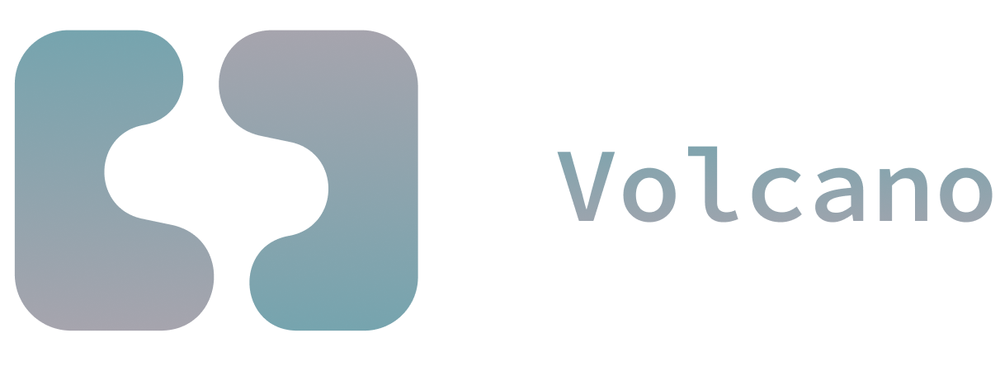
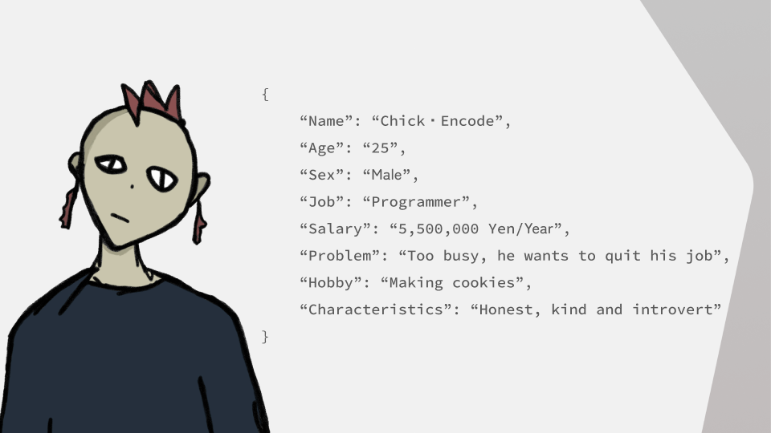
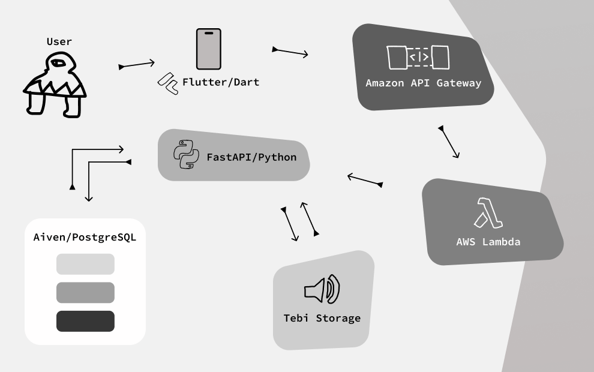
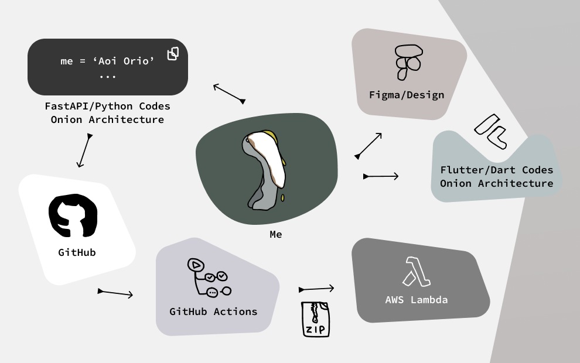
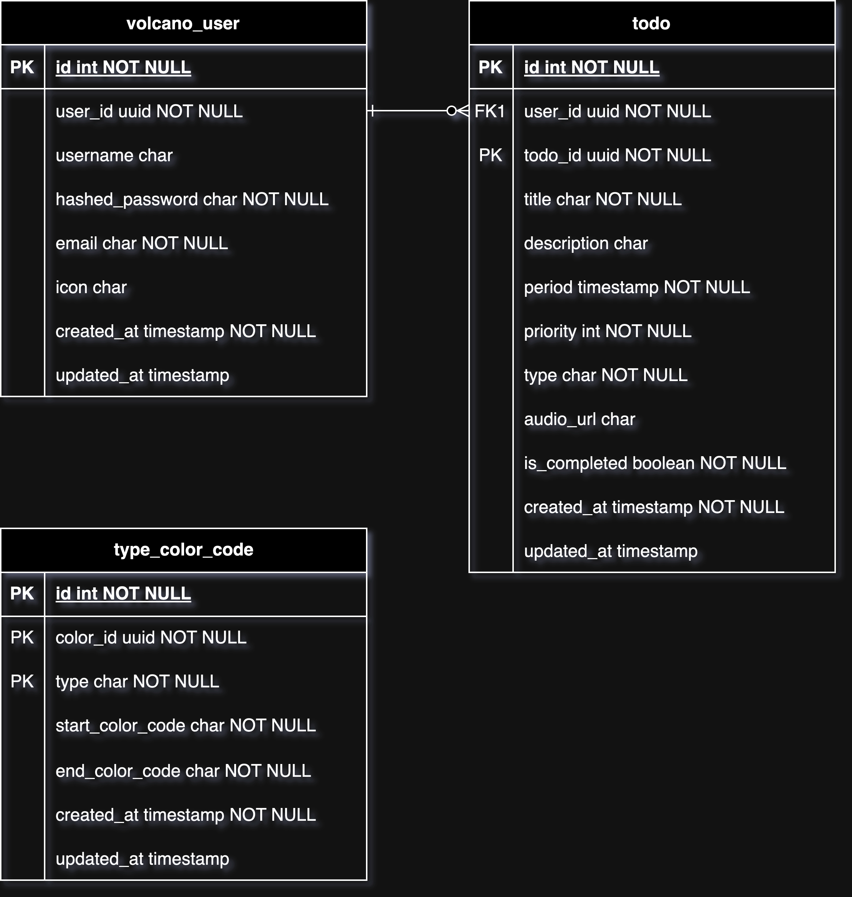
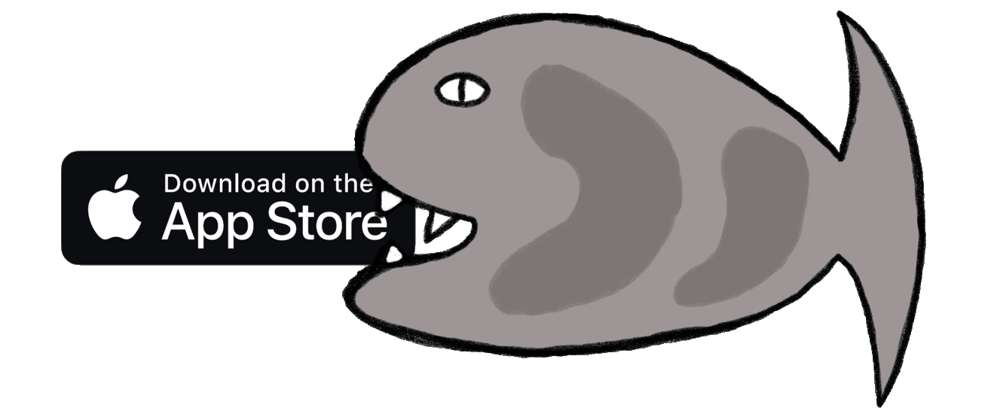

<div align="center">
    
    <br>
    <a href="https://apps.apple.com/jp/app/volcano-with-todo/id6657991782">
        
    </a>
    <br>
    <br>
    <a href="https://github.com/aoiorio/Volcano/releases/tag/v1.1.0">
        
    </a>
    <a href="https://github.com/aoiorio/VolcanoAPI">
        
    </a>
    
    
    
    
    
    
</div>

<br>

<br>

<br>

## ```🌋 {"Contents"}```

### [```{1: "🫣 Overview"}```](#1--overview-1)

### [```{2: "🍽️ Methods"}```](#2-️-methods-1)

### [```{3: "🫐 Thoughts"}```](#3--thoughts-1)


### [🍣 "Japanese"](https://github.com/aoiorio/Volcano/blob/main/README_jp.md)
<br>

<br>

<br>


# ```{1: "🫣 Overview"}```

<br>


<br>

## ```🌭 "What is Volcano"```

**Volcano** is a simple TODO app that can recognize your voices and convert them to texts as a **TODO**.
You can tell your TODO to Volcano like you're speaking with someone.

<br>

## ```🧈 "Why"```

I usually write down my TODOs on my note every single day.
<br>
But I perceived that it's pain in the neck and I will definitely forget something what I'm going to do today.

So I came up with an application idea to manage my TODOs with more comfortable way.

I thought recognizing my voice can be a powerful feature to remember what I was planning to do.

That's the reason of why Volcano was created.

<br>

## ```🐓 "Persona"```



<br>

## ```🍈 "Features & Durations"```

<br>

- 📁 "TODO"

    - **Voice Recognizing Feature & Add TODO From Voice Feature** - 2024/06/12 - 06/28

    - **Add TODO From Text Feature** - 2024/06/12 - 06/28

    - **Playing Voice Feature** - 2024/06/28 - 07/6

    - **Mark as accomplished Feature** - 2024/06/28 - 07/6

    - **Delete TODO Feature** - 2024/07/7 - 07/14

    - **Edit TODO Feature** - 2024/07/7 - 07/14

    - **Showing TODO With Each Type Feature** - 2024/06/28 - 07/6

    - **Showing Today's TODO Feature** - 2024/07/3 - 07/8

    - **Showing Month's TODO Feature** - 2024/06/28 - 07/6

    - **Sending Notification every morning Feature (new)** - 2024/08/27 - 08/29

<br>

- 🥕 "User"

    - **Sign In Feature** - 2024/06/02 - 06/11

    - **Sign Up Feature** - 2024/06/02 - 06/11

    - **Sign Out Feature** - 2024/07/14 - 07/22

    - **Deleting User Feature** - 2024/07/14 - 07/22

    - **Edit Username Feature** - 2024/07/14 - 07/22

### 💻 Overall: 2024/05/19 - 2024/08/26 (100 days)

<br>

## ```🫨 "Links"```
- "🦀 Volcano API": [Volcano API](https://github.com/aoiorio/VolcanoAPI)
- "🪡 Slides": [Volcano Slides](https://docs.google.com/presentation/d/1eIEV2Hm08teWd2m_5D9OY7se3-NyqIaro5_hdHCcKiI/edit?usp=sharing)
- "🧳 Requirements Definition Slides": [Volcano Requirements Definition Slides](https://docs.google.com/presentation/d/1VScbl4NEXO8QbhK5rt-C63ebLQKySBvkVg6RB1wOrgI/edit?usp=sharing)

<br>

<br>

<br>

# ```{2: "🍽️ Methods"}```

<br>

## ```📺 "Technologies"```

### 🪟 "Front-End"
<br>

  

### 🐘 "Back-End"
  

### 🌯 "Infrastructure"
 

### 🫑 "Design"
<a href="https://www.figma.com/design/mdtvg3qX7BxmcpDqgEFeJM/Volcano?node-id=0-1&t=jY2GYAAmbcv06Y3E-1">
    
</a>

<br>

<details><summary>"📂 Folder Structure"</summary>

## ```"📂 Folder Structure"```
```dart
└── 📁lib
    └── 📁core
        └── errors.dart // for writing original error type (e.g. BackEndError)
    └── 📁domain // for creating the base
        └── 📁entity
        └── 📁repository
        └── 📁usecase
    └── 📁gen // for storing generated assets by using fluttergen
    └── 📁infrastructure // for materializing the methods of repository from domain
        └── 📁datasource // for creating methods of getting data from API Endpoints
            └── 📁auth
            └── 📁todo
            └── 📁type_color_code
            └── 📁user
        └── 📁dto // for specializing the type of data
        └── 📁model // for the types that users input
            └── 📁auth
            └── 📁todo
            └── 📁user
        └── 📁repository // for using datasource to materialize reposiotry methods of domain 
    └── 📁presentation // for creating UI
        └── 📁component
            └── 📁global
            └── 📁modal
            └── 📁sign_in
            └── 📁sign_up
            └── 📁todo
        └── 📁importer
            └── volcano_page_importer.dart
        └── 📁page
            └── 📁auth
            └── 📁dialogs
            └── 📁todo_details
            └── 📁tutorial
            └── 📁volcano
        └── 📁provider // for managing data by using riverpod
            └── 📁back
                └── 📁auth
                └── 📁todo
                └── 📁type_color_code
                └── 📁user
                └── global_back_providers.dart
            └── 📁front
                └── 📁auth
                └── 📁notification
                └── 📁todo
                └── 📁tutorial
            └── 📁global
        └── 📁routes
            └── 📁routes_model
            └── routes.dart
        └── 📁supporter
            └── notification_random_message.dart
        └── 📁theme
            └── theme.dart
    └── 📁usecase // for giving data to presentation layer with repository methods
    └── main.dart
```

</details>


<br>

## ```🐊 "Flutter Dependencies"```

- 🏆 "State Management"
    - [flutter_riverpod](https://pub.dev/packages/flutter_riverpod)
    - [flutter_hooks](https://pub.dev/packages/flutter_hooks) (for useEffect and useState method)
    - [hooks_riverpod](https://pub.dev/packages/hooks_riverpod)
    - [riverpod_annotation](https://pub.dev/packages/riverpod_annotation)

<br>

- 🐙 "Connecting To The API Endpoints"
    - [retrofit](https://pub.dev/packages/retrofit)
    - [dio](https://pub.dev/packages/dio)
    - [http](https://pub.dev/packages/http)
    - [fpdart](https://pub.dev/packages/fpdart) (for using Either as a type)

<br>

- 🌎 "Implementing Authentication Feature"
    - [shared_preferences](https://pub.dev/packages/shared_preferences) (for storing JWT token)

<br>

- 🦁 "Creating Voice To TODO Feature"
    - [speech_to_text](https://pub.dev/packages/speech_to_text) (for recognizing voice)
    - [record](https://pub.dev/packages/record) (for recording voice)
    - [audio_waveforms](https://pub.dev/packages/audio_waveforms) (for displaying audio waves while users are recording)
    - [just_audio](https://pub.dev/packages/just_audio) (for playing audio from URL)

<br>

- 🎧 "Implementing Notification Feature"
    - [flutter_local_notifications](https://pub.dev/packages/flutter_local_notifications) (for send notification at fixed time everyday)
    - [flutter_app_badger](https://pub.dev/packages/flutter_app_badger) (for removing badge from the app icon)

<br>

- 🚌 "Transition"
    - [go_router](https://pub.dev/packages/go_router)
    - [page_transition](https://pub.dev/packages/page_transition) (for making smooth transaction)

<br>

- 🎲 "Creating UI"
    - [shimmer](https://pub.dev/packages/shimmer) (for providing great UX by using skelton effects)
    - [percent_indicator](https://pub.dev/packages/percent_indicator) (for displaying percentage from number for TODO goals)
    - [smooth_page_indicator](https://pub.dev/packages/smooth_page_indicator) (for creating dots under TODO goals cards)
    - [gap](https://pub.dev/packages/gap) (for making some gaps between widgets)
    - [flutter_spinkit](https://pub.dev/packages/flutter_spinkit) (for displaying hourglass when Volcano is loading)
    - [fluttertoast](https://pub.dev/packages/fluttertoast) (for displaying whether it's successful or not)
    - [modal_bottom_sheet](https://pub.dev/packages/modal_bottom_sheet) (for making UserModal)

<br>

- 🐗 "Others"
    - [flutter_gen](https://pub.dev/packages/flutter_gen) (for controlling images and fonts)
    - [flutter_svg](https://pub.dev/packages/flutter_svg) (for importing svg)
    - [url_launcher](https://pub.dev/packages/url_launcher) (for launching privacy policy and terms of service docs)
    - [flutter_native_timezone](https://pub.dev/packages/flutter_native_timezone) (for setting local timezone)
    - [pedantic_mono](https://pub.dev/packages/pedantic_mono) (for analyzing my codes)
    - [flutter_lints](https://pub.dev/packages/flutter_lints)

**And more! If you want to check all of them, please go to my [pubspec.yaml](https://github.com/aoiorio/Volcano/blob/main/pubspec.yaml#L30-L82)**

<br>


## ```📸 "Pictures"```
<br>

| "As an User"| "As a Developer"|
|----|----|
|||

<br>

## ```🧠 "ERD"```
<div align="center">

</div>
<br>

<br>

<br>

# ```{3: "🫐 Thoughts"}```

<br>

## ```💎 "My Favorites"```
<br>

###  1. 🐠 **Saving Hex Color Code In Database**
- Reason
    - I wanted to create a great app to recognize types directly through my eyes

- Difficult Points
    - Converting color codes to Flutter's color codes
    - Generating RBG with range for color I like

### 2. 🙃 Displaying Today's TODOs
- Reason
    - When I open Volcano in the morning, I can see what I have to do today and achieve it without forgetting something

- Difficult Points
    - I was torn between splitting the API endpoints of getting Today's TODO and Month's TODO or not (Finally I decided to combine them together)

### 3. 🗂️ Using Onion Architecture
- Reason
    - I usually write spaghetti codes so I was craving for writing clean and updatable codes by myself

- Difficult Points
    - I've started to learn about Onion Architecture without any knowledge of it. So I struggled with how I create folder structure

<br>

## ```🤠 "What I've got"```
<br>

### "I felt like I was working with my teammates even I've developed this by my own"
- I used architecture like I was creating an app with someone
- When I merge my PR to a branch, I always send "LGTM" photo on my issue or PR pages and it seemed like I was reviewed from my boss
- I also tried to separate URLs of Amazon API Gateway such as prod and dev like the actual projects do in companies


<br>

<br>

<a href="https://www.buymeacoffee.com/aoiorio" target="_blank"></a>


<br>

<br>

```python
{
    "status_code": 500,
    "message": "Thank you."
}
```

<br>

<br>

 <a href="https://apps.apple.com/jp/app/volcano-with-todo/id6657991782">
    <div align=center>
        
    </div>

 </a>
