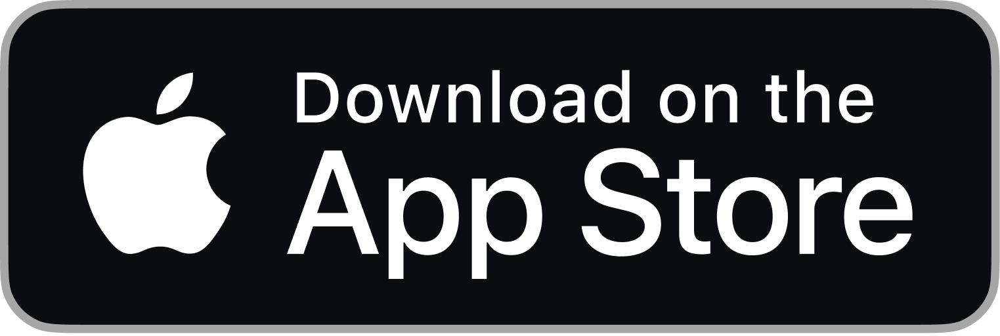

    
     
    <a href="https://apps.apple.com/jp/app/volcano-with-todo/id6657991782">
        
        <!-- TODO draw illustration of Download on the App Store -->
    </a>
         
         
    
    
    
    
    
    
    
    

 

 

 

 

# 🌋 {"Contents"}

### [{1: "🫣 Overview"}]()

### [{2: "🍽️ Methods"}]()

### [{3: "🫐 Thoughts"}]()

### [{4. "🦭 Next"}]()

 

 

 

# {1: "🫣 Overview"}

 

 

## 🌭 {"What is Volcano"}

**Volcano** is a simple TODO app that can recognize your voices and convert them to texts as a **TODO**.
You can tell your TODO to Volcano like you're speaking with someone.

 

## 🧈 {"Why"}

I usually write down my TODOs on my note every single day.
 
But I perceived that it's pain in the neck and will definitely forget something what I'm going to do today.

So I came up with an application idea to manage my TODOs with more comfortable way.

I thought recognizing my voice can be a powerful feature to remember what I was planning to do.

That's the reason of why Volcano was created.

 

## 🐓 {"Persona"}

 

## 🍈 {"Features & Terms"}

 

- 📁 "TODO"

    - **Voice Recognizing Feature & Add TODO From Voice Feature** - 2024/06/12 - 06/28

    - **Add From Text Feature** - 2024/06/12 - 06/28

    - **Playing Voice Feature** - 2024/06/28 - 07/6

    - **Mark as accomplished Feature** - 2024/06/28 - 07/6

    - **Delete TODO Feature** - 2024/07/7 - 07/14

    - **Edit TODO Feature** - 2024/07/7 - 07/14

    - **Showing TODO With Each Type Feature** - 2024/06/28 - 07/6

    - **Showing Today's TODO Feature** - 2024/07/3 - 07/8

    - **Showing Month's TODO Feature** - 2024/06/28 - 07/6

    - **Sending Notification every morning Feature (new)** - 2024/08/27 - 08/29

 

- 🥕 "User"

    - **Sign In Feature** - 2024/06/02 - 06/11

    - **Sign Up Feature** - 2024/06/02 - 06/11

    - **Sign Out Feature** - 2024/07/14 - 07/22

    - **Deleting User Feature** - 2024/07/14 - 07/22

    - **Edit Username Feature** - 2024/07/14 - 07/22

### 💻 Overall: 2024/05/19 - 2024/08/26 (100 days)

 

## 🫨 {"Links"}
- "🦀 Volcano API": [Volcano API](https://github.com/aoiorio/VolcanoAPI)
- "🪡 Slides": [Volcano Slides](https://docs.google.com/presentation/d/1eIEV2Hm08teWd2m_5D9OY7se3-NyqIaro5_hdHCcKiI/edit?usp=sharing)
- "🧳 Requirements Definition Slides": [Volcano Requirements Definition Slides](https://docs.google.com/presentation/d/1VScbl4NEXO8QbhK5rt-C63ebLQKySBvkVg6RB1wOrgI/edit?usp=sharing)
